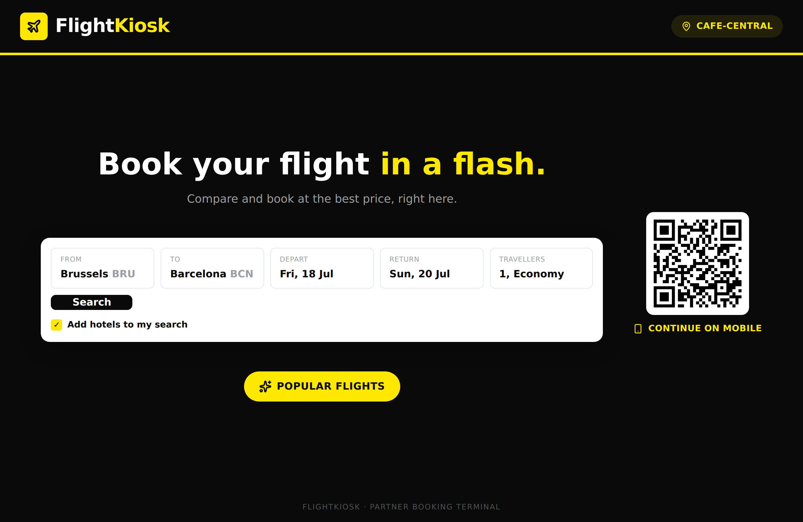
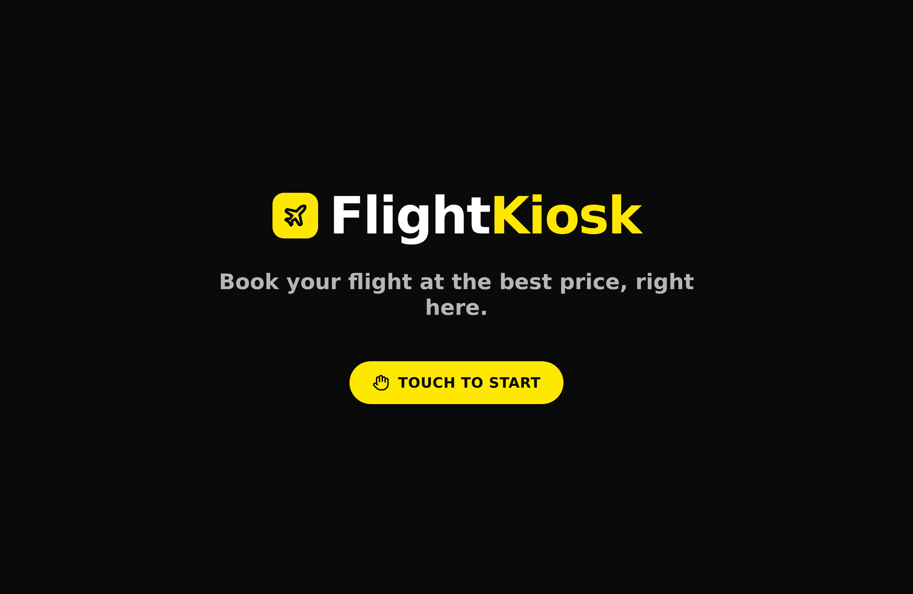

# Flight Kiosk Widget

<p align="center">
  <a href="https://vercel.com/new/clone?repository-url=https://github.com/tovrr/flight-kiosk-widget">
    
  </a>
  &nbsp;
  <a href="LICENSE"></a>
  
  
</p>

A self-service **flight-booking kiosk** for physical shops — designed to run
fullscreen on a tablet/iPad in kiosk mode. A customer searches for a flight,
compares prices, and books, while the partner shop is tracked via a `?ref=`
in the URL. Monetisation is
**[Travelpayouts](https://www.travelpayouts.com/?marker=749997) affiliate**
(you earn a commission on every booking).

Fork it, plug in your own Travelpayouts IDs, set a brand, and deploy — no code
changes required. Everything is configured through environment variables.



<p align="center"><em>Booking screen · the attract screen shown between customers 👇</em></p>



> The widget above is rendered from a mock in this demo; in production the real
> Travelpayouts flight-search form loads in its place.

---

## 💸 Deploy your own \## 💸 Deploy your own & earn — in 5 minutes earn — in 5 minutes

> 🏗️ Built by [**DevForge Systems**](https://devforge.systems) — enterprise software development, from build to deploy.

---

## 💸 Deploy your own \## 💸 Deploy your own & earn — in 5 minutes earn — in 5 minutes

Every flight booked through your kiosk pays **you** an affiliate commission via
Travelpayouts. This template is the fastest way to get a branded,
production-ready booking kiosk (or an embeddable widget) live — **no code, just
environment variables**.

<p align="center">
  <a href="https://vercel.com/new/clone?repository-url=https://github.com/tovrr/flight-kiosk-widget">
    
  </a>
</p>

1. **[Create a free Travelpayouts account](https://www.travelpayouts.com/?marker=749997)** and grab your marker + a Flights Search Form `trs`.
2. **Deploy** (one click above), paste those two values as env vars.
3. **Put a tablet in a shop** — or drop the `<script>` on any site — and earn on every booking. You keep **100 % of the affiliate commission**.

> **Transparency:** the Travelpayouts sign-up link above carries the
> maintainer's *refer-a-partner* marker. It costs you **nothing** and does **not**
> reduce your commissions — Travelpayouts simply shares a small slice of *their*
> own margin with the referrer. Prefer not to? Just sign up directly at
> [travelpayouts.com](https://www.travelpayouts.com/). Either way, the code is
> yours under MIT.

---

## Features

- **Kiosk mode** — fullscreen, no scroll, locked viewport, tablet-first.
- **Attract screen** ("Touch to start") + **idle reset** between customers.
- **Travelpayouts flight-search widget** with per-shop tracking (`shmarker`),
  no Aviasales logo / "Powered by".
- **Offline fallback** — a clean "service unavailable / retry" card when the
  in-store wifi drops, instead of an empty frame.
- **Mobile-continuity QR** — the customer scans it to finish on their phone,
  keeping the shop `?ref=` intact.
- **Optional "Popular flights"** button to your results / White Label page.
- **Embeddable** on any website with a one-line `<script>` (`/embed` + `embed.js`).
- Fully **rebrandable** (name + colours) via env vars, **installable PWA**.
- **Resilient by design** — service worker caches the app shell (reloads offline
  if the wifi drops), self-healing error screen, and the screen stays awake.
- **Built-in languages** (EN / FR / NL) via `NEXT_PUBLIC_LOCALE`.

---

## How the affiliate model works

1. A shop's kiosk URL carries its name: `https://your-app.com/?ref=shop-name`.
2. That `ref` is stored and folded into the Travelpayouts marker as
   `MARKER.shop-name` (`shmarker`), so every booking is traced to the shop.
3. The customer searches → is redirected to the results page → books with the
   seller. **Travelpayouts pays you the commission** (marker), and you know
   which shop drove it (sub-marker).

---

## Deploy your own

### 1. Get a Travelpayouts account

Sign up at [travelpayouts.com](https://www.travelpayouts.com/?marker=749997).
From the dashboard you need:

- your **marker / Partner ID** → `NEXT_PUBLIC_TRAVELPAYOUTS_MARKER`
- a **"Flights Search Form"** widget → copy its **`trs`** →
  `NEXT_PUBLIC_TP_TRS`
- *(optional)* the **Drive** domain-verification script URL →
  `NEXT_PUBLIC_TP_DRIVE_SRC`
- *(optional)* a **White Label** domain for branded results →
  `NEXT_PUBLIC_TP_SEARCH_URL` / `NEXT_PUBLIC_RESULTS_URL`

### 2. One-click deploy (Vercel)

[](https://vercel.com/new/clone?repository-url=https://github.com/tovrr/flight-kiosk-widget)

Set the environment variables (see below) during the import, then deploy.
Because `NEXT_PUBLIC_*` values are baked in at build time, **changing them
later requires a redeploy** (uncheck "Use existing Build Cache").

### 3. Point your kiosk at it

Open the deployed URL with a shop ref, e.g.
`https://your-app.com/?ref=shop-name`, and put the tablet in guided-access /
kiosk mode.

---

## Embed on an existing website

Besides the full-screen kiosk, the search widget can be dropped into any
website with **one line** — like a Calendly/Typeform embed:

```html
<script src="https://your-app.com/embed.js" data-ref="your-shop" async></script>
```

- Injects a responsive `<iframe>` of the flight-search widget right where the
  script is placed (or into `data-target="#some-element"`).
- Auto-resizes to its content height, transparent background to blend in.
- Tracked by `data-ref` (same `?ref=` → marker model as the kiosk).

The widget lives at `/embed?ref=...` and is the only route allowed to be framed
by third-party sites (every other route stays `X-Frame-Options: SAMEORIGIN`).

---

## Environment variables

| Variable | Required | Default | Role |
| --- | :---: | --- | --- |
| `NEXT_PUBLIC_TRAVELPAYOUTS_MARKER` | ✅ | `000000` | Your partner marker (base of `shmarker`). Placeholder = no attribution. |
| `NEXT_PUBLIC_TP_TRS` | ✅ | — | Tracking source id of your Flights Search Form widget. |
| `NEXT_PUBLIC_TP_DRIVE_SRC` | | — | Drive domain-verification script URL (injected only if set). |
| `NEXT_PUBLIC_TP_SEARCH_URL` | | — | Host (no protocol) where results open, e.g. your White Label. |
| `NEXT_PUBLIC_SHOW_HOTELS` | | `false` | Show the "also search hotels" checkbox in the flight widget. |
| `NEXT_PUBLIC_BRAND_PREFIX` | | `Flight` | Brand name, first tone (foreground). |
| `NEXT_PUBLIC_BRAND_SUFFIX` | | `Kiosk` | Brand name, second tone (accent). |
| `NEXT_PUBLIC_COLOR_PRIMARY` | | `#0A0A0A` | Widget primary colour. |
| `NEXT_PUBLIC_COLOR_ACCENT` | | `#FFE800` | Widget accent colour. |
| `NEXT_PUBLIC_SITE_URL` | | current origin | Canonical URL for the mobile-continue QR. |
| `NEXT_PUBLIC_RESULTS_URL` | | — | Full URL for the "Popular flights" button (hidden if empty). |
| `NEXT_PUBLIC_LOCALE` | | `en` | Widget / page language. |
| `NEXT_PUBLIC_CURRENCY` | | `usd` | Widget currency. |
| `NEXT_PUBLIC_IDLE_TIMEOUT_MS` | | `90000` | Idle delay before the kiosk resets. |

> ⚠️ These are **identifiers, not secrets** — they ship in the client bundle by
> design. **Never** put a Travelpayouts API token in a `NEXT_PUBLIC_*` variable.

---

## Local development

```bash
cp .env.example .env.local   # fill in your values
npm install
npm run dev                  # http://localhost:3000/?ref=demo-shop
npm run lint                 # ESLint (next/core-web-vitals)
npm test                     # unit tests (Vitest)
```

The Travelpayouts widget loads its script from `tpwidg.com`; if your network
blocks it you'll see the offline fallback — that's expected locally.

## Customisation

- **Name / colours** → env vars above. To also restyle the app chrome (not just
  the widget), edit the two colours in `app/globals.css` (Tailwind v4 `@theme`
  is static, so it can't read env at runtime).
- **Language** → set `NEXT_PUBLIC_LOCALE` (`en`, `fr`, `nl` built in). Add a
  locale by extending the dictionary in `lib/i18n.js`; the widget follows the
  same variable.
- **Icon** → replace `app/icon.svg` (also used as the PWA icon).

## Data & privacy

This app is a thin, brand-able shell around Travelpayouts — it runs almost no
logic of its own, and **collects no personal data**.

- **What it stores:** only the `?ref=` shop code, in `localStorage`, to keep
  per-shop attribution across a reload. No names, emails, accounts, or payment
  data — ever. No first-party tracking cookies.
- **What flows where:** the search widget and the results page are both hosted
  by **Travelpayouts**. When a visitor searches, only the **search query**
  (route, dates, passengers) and your **marker** are passed — via the URL — to
  the results page. There is no shared backend and no database.
- **Payments** happen on the airline/OTA's own checkout, never here, so there is
  no card handling or PCI scope.
- **Isolation:** every deployment uses its own marker/White Label (its own env
  vars). One fork can never read another's traffic or bookings.
- **`NEXT_PUBLIC_*` values are identifiers, not secrets** — they ship in the
  client bundle by design. Never put an API token in one.

Add your own privacy notice if your jurisdiction requires one; the third-party
Travelpayouts scripts have their own policy.

## Stack

Next.js 16 (App Router) · React 18 · Tailwind CSS 4 · `react-qr-code` ·
`lucide-react` · Node 22.

## License

[MIT](LICENSE) — do whatever you want, no warranty.
